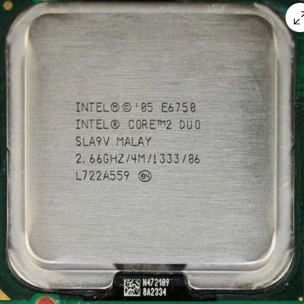
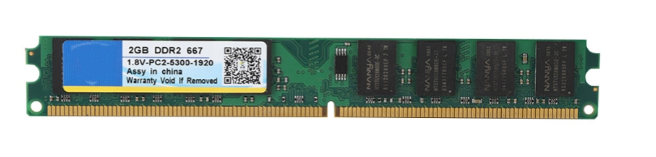
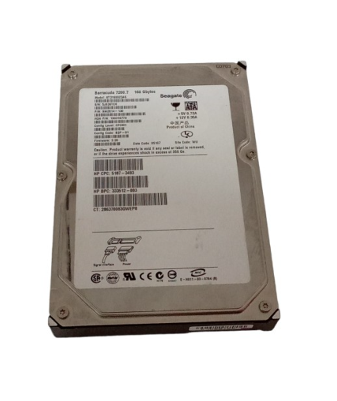

# 30 — Mercado y recambios

> Selección de componentes compatibles para mantenimiento o mejora del equipo.

## 1) Microprocesador (Mejora)
- **Componente a sustituir:** Intel Core 2 Duo E6750
- **¿Existe el mismo modelo exacto en tiendas?:** Solo segunda mano
- **Alternativa compatible (socket/ranura):** Intel Core 2 DUO Q9550 (Socket LGA775)
- **Precio aproximado (€):** 6,00 €
- **URL:** https://www.ebay.es/itm/116536930026?chn=ps&norover=1&mkevt=1&mkrid=1185-171098-620544-2&mkcid=2&mkscid=101&itemid=116536930026&targetid=4587643557342510&device=c&mktype=&googleloc=292365&poi=&campaignid=604142992&mkgroupid=1344705146320141&rlsatarget=pla-4587643557342510&abcId=9410770&merchantid=137185&msclkid=0ab3fe0142a416c19b549775b59ccd19
- **Captura:** 

**Justificación breve:** He elegido el Q9550 porque utiliza el mismo socket LGA775 de la placa base y mejora el rendimiento al pasar de 2 a 4 núcleos físicos.

## 2) Memoria RAM (Ampliación)
- **Componente a sustituir:** Módulos Elpida DDR2 667MHz
- **¿Existe el mismo modelo exacto en tiendas?:** Sí
- **Alternativa compatible (socket/ranura):** Módulo 2GB DDR2 800MHz PC2-6400
- **Precio aproximado (€):** 20,00 €
- **URL:** https://www.worten.es/productos/memoria-ram-2g-667mhz-240pins-ddr2-pc2-5300-para-desktop-amd-1-8v-luz-dourada-mrkean-8039716709763
- **Captura:** 

**Justificación breve:** Este módulo es compatible porque la placa HP soporta memoria DDR2. Al ser de 800MHz, trabajará correctamente adaptándose a la velocidad de la placa.

## 3) Almacenamiento (Mejora)
- **Componente a sustituir:** Disco duro Seagate 160GB HDD
- **¿Existe el mismo modelo exacto en tiendas?:** Si, pero son de 2 mano o reacondicionados
- **Alternativa compatible (socket/ranura):** SSD SATA III 240GB
- **Precio aproximado (€):** 
20,00 €
- **URL:** https://superparts.es/discos-duros/disco-duro-ordenador-seagate-160gb-st3160023as
- **Captura:** 

**Justificación breve:** Sustituir el disco mecánico por un SSD SATA es la mejor mejora posible, ya que utiliza el mismo cable de datos pero es mucho más rápido al cargar el sistema.
