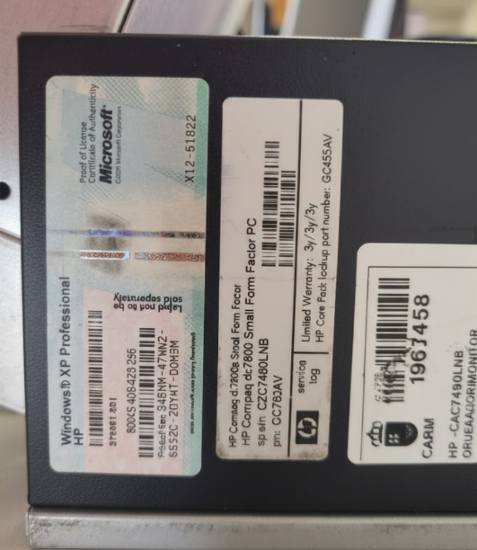
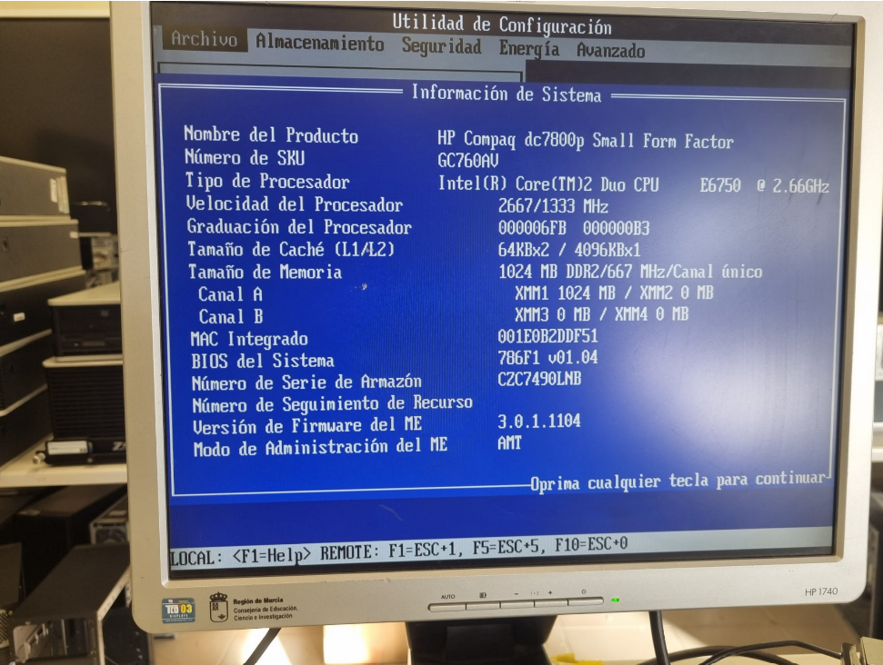
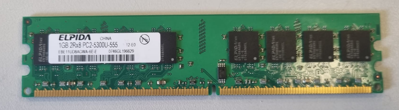
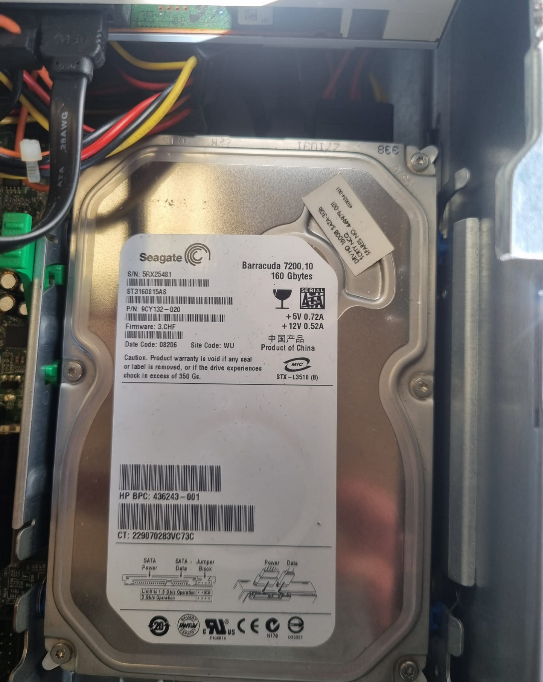
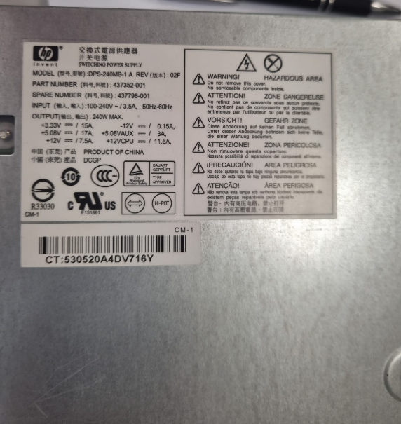
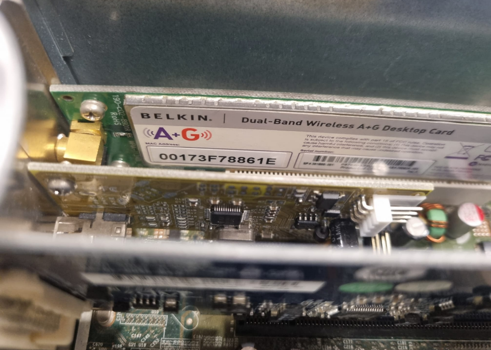

# 90 — ENTREGA ÚNICA (consolidado)

## Portada
# 00 — Portada
- Alumno/a: **José Antonio Rodríguez González**
- Puesto/Equipo asignado: **5**
- Fecha: **24/01/2025**
- Módulo: **Fundamentos de Hardware (1º ASIR)**
- Unidad: **UT3 — Ensamblado de equipos**
- Reto: **Reto 01 — Práctica de Taller**

## Indice
# 01 — Índice
1. [Portada](00-portada.md)
2. [Instrucciones](02-instrucciones.md)
3. [Toma de datos en taller](10-toma_de_datos/plantilla_tabla_taller.md)
4. [Investigación técnica](20-investigacion_tecnica/plantilla_investigacion.md)
5. [Mercado y recambios](30-mercado_y_recambios/plantilla_recambios.md)
6. [Observaciones personales](40-observaciones/plantilla_observaciones.md)
7. [ENTREGA ÚNICA](90-ENTREGA_UNICA.md)
8. [Checklist](99-entrega_y_checklist.md)

---
## Toma de# 10 — Toma de datos (taller)

> Datos extraídos directamente del hardware del Equipo 5 en el taller.

| Componente | Marca/Fabricante | Modelo/Serie | Características técnicas visibles | Foto |
|---|---|---|---|---|
| **Placa base** | HP | 437793-001 (dc7800) | Chipset Intel / Socket LGA775 / 4 slots RAM |  |
| **Microprocesador** | Intel | Core 2 Duo E6750 | 2.66 GHz / 4MB L2 / FSB 1333 MHz |  |
| **Memoria RAM** | HP (Elpida) | PC2-5300U-555 | DDR2 / 1GB (2x512MB) / 667 MHz (Tiene 2 tarjetas RAM)|  |
| **Disco HDD/SSD** | Seagate | Barrac|uda 7200.10 | Interfaz SATA / 160 GB / 7200 RPM |  |
| **Fuente de alimentación** | HP | DPS-240MB-1 A | Potencia 240W / Modelo 437352-001 |  |
| **Otros (GPU/Tarjetas)** | Silicon Image / Belkin / Agere |ADD2-N / Wireless A+G / Modem | DVI / Wifi Dual-Band / RJ-11 |     |
|

## Investigación técnica — resumen
# 20 — Investigación técnica (posterior)

## 1) Detalles del procesador
- Modelo exacto: Intel Core 2 Duo E6750
- Núcleos/Hilos: 2 núcleos / 2 hilos
- TDP: 65 W

Respuesta: Según la información de Intel Ark, este procesador utiliza el socket LGA775 y tiene una frecuencia básica de 2.66 GHz con 4 MB de caché L2.

## 2) Soporte de memoria (según placa base)
- Modelo exacto de placa: HP 437793-001 (Chipset Q35 Express)
- Capacidad máxima RAM: 8 GB
- Velocidad máxima soportada: DDR2 800 MHz

Respuesta: La placa base del HP Compaq dc7800p cuenta con 4 ranuras DIMM. Aunque actualmente tiene instalados módulos a 667 MHz, el chipset permite ampliar la memoria hasta 8 GB utilizando módulos de mayor velocidad.

## Recambios — resumen
# 30 — Mercado y recambios

> Selección de componentes compatibles para mantenimiento o mejora del equipo.

## 1) Microprocesador (Mejora)
- **Componente a sustituir:** Intel Core 2 Duo E6750
- **¿Existe el mismo modelo exacto en tiendas?:** Solo segunda mano
- **Alternativa compatible (socket/ranura):** Intel Core 2 DUO Q9550 (Socket LGA775)
- **Precio aproximado (€):** 6,00 €
- **URL:** https://www.ebay.es/itm/116536930026?chn=ps&norover=1&mkevt=1&mkrid=1185-171098-620544-2&mkcid=2&mkscid=101&itemid=116536930026&targetid=4587643557342510&device=c&mktype=&googleloc=292365&poi=&campaignid=604142992&mkgroupid=1344705146320141&rlsatarget=pla-4587643557342510&abcId=9410770&merchantid=137185&msclkid=0ab3fe0142a416c19b549775b59ccd19
- **Captura:** 

**Justificación breve:** He elegido el Q9550 porque utiliza el mismo socket LGA775 de la placa base y mejora el rendimiento al pasar de 2 a 4 núcleos físicos.

## 2) Memoria RAM (Ampliación)
- **Componente a sustituir:** Módulos Elpida DDR2 667MHz
- **¿Existe el mismo modelo exacto en tiendas?:** Sí
- **Alternativa compatible (socket/ranura):** Módulo 2GB DDR2 800MHz PC2-6400
- **Precio aproximado (€):** 20,00 €
- **URL:** https://www.worten.es/productos/memoria-ram-2g-667mhz-240pins-ddr2-pc2-5300-para-desktop-amd-1-8v-luz-dourada-mrkean-8039716709763
- **Captura:** 

**Justificación breve:** Este módulo es compatible porque la placa HP soporta memoria DDR2. Al ser de 800MHz, trabajará correctamente adaptándose a la velocidad de la placa.

## 3) Almacenamiento (Mejora)
- **Componente a sustituir:** Disco duro Seagate 160GB HDD
- **¿Existe el mismo modelo exacto en tiendas?:** Si, pero son de 2 mano o reacondicionados
- **Alternativa compatible (socket/ranura):** SSD SATA III 240GB
- **Precio aproximado (€):** 
20,00 €
- **URL:** https://superparts.es/discos-duros/disco-duro-ordenador-seagate-160gb-st3160023as
- **Captura:** 

**Justificación breve:** Sustituir el disco mecánico por un SSD SATA es la mejor mejora posible, ya que utiliza el mismo cable de datos pero es mucho más rápido al cargar el sistema.

## Observaciones — resumen
# 40 — Observaciones personales

> Anotaciones finales sobre el estado físico y posibles mejoras detectadas en el equipo.

- **Observación 1 (Limpieza):** Se ha detectado una acumulación considerable de polvo en los ventiladores de la CPU y de la fuente de alimentación, lo que podría afectar a la refrigeración a largo plazo.
- **Observación 2 (Estado físico):** Los condensadores de la placa base parecen estar en buen estado (no están hinchados), y el chasis metálico no presenta signos de corrosión importantes.
- **Observación 3 (Componentes):** El equipo conserva componentes originales como la disquetera y la unidad de DVD, pero le falta la antena externa para la tarjeta wifi Belkin, lo que reduciría la calidad de la señal.

